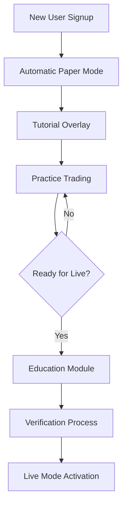
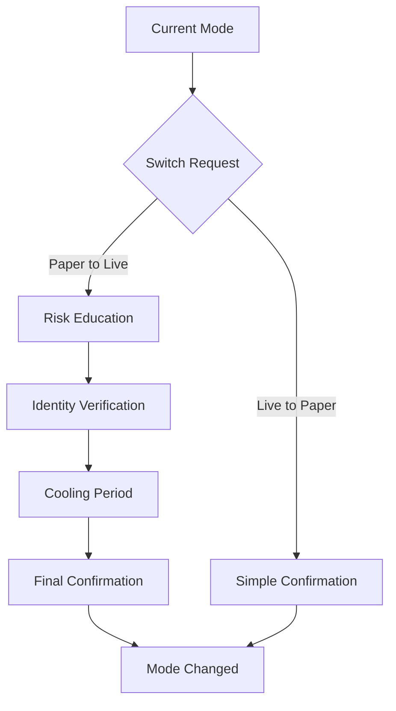

# Paper Trading User Experience Design

## Executive Summary

This document defines the user experience design to prevent mode confusion and ensure intuitive paper trading operations, addressing BUS-001 (High Risk) for Story 2.1.

## 1. Design Principles

### 1.1 Core UX Principles

1. **Clarity Over Aesthetics**: Mode indicators must be unmistakably clear
2. **Progressive Disclosure**: Complex features revealed gradually
3. **Fail-Safe Defaults**: Always default to safer options
4. **Consistent Feedback**: Every action has clear, immediate feedback
5. **Accessibility First**: Usable by all traders regardless of abilities

### 1.2 Mode Differentiation Strategy

| Aspect | Paper Mode | Live Mode |
|--------|------------|-----------|
| Primary Color | Blue (#0066CC) | Red (#FF0000) |
| Secondary Color | Light Blue (#E6F2FF) | Light Red (#FFE6E6) |
| Border Style | Dashed | Solid |
| Icon | 🔵 📝 | 🔴 💰 |
| Animation | None | Pulse |
| Sound | Soft chime | Alert tone |

## 2. User Interface Components

### 2.1 Global Mode Indicator

```python
# frontend/components/global_mode_indicator.py
import streamlit as st
from typing import Dict, Any

class GlobalModeIndicator:
    """Always-visible mode indicator with multiple sensory cues"""
    
    def render(self, mode: str, metrics: Dict[str, Any]):
        """Render the global mode indicator"""
        
        # Create sticky header
        header = st.container()
        
        with header:
            # Mode indicator bar
            if mode == "LIVE":
                st.markdown("""
                    <div class="mode-indicator-live">
                        <div class="pulse-animation">
                            🔴 LIVE TRADING - REAL MONEY
                        </div>
                        <div class="mode-metrics">
                            <span>Balance: ₹{balance:,.2f}</span>
                            <span>P&L: {pnl:+.2f}%</span>
                            <span>Risk: {risk}/10</span>
                        </div>
                    </div>
                """.format(**metrics), unsafe_allow_html=True)
                
                # Audio alert on first load
                if st.session_state.get('mode_changed'):
                    st.audio("assets/sounds/live_mode_alert.mp3", autoplay=True)
                    
            else:  # PAPER mode
                st.markdown("""
                    <div class="mode-indicator-paper">
                        <div class="static-header">
                            🔵 PAPER TRADING - PRACTICE MODE
                        </div>
                        <div class="mode-metrics">
                            <span>Virtual: ₹{balance:,.2f}</span>
                            <span>Practice P&L: {pnl:+.2f}%</span>
                            <span>No Risk</span>
                        </div>
                    </div>
                """.format(**metrics), unsafe_allow_html=True)
```

### 2.2 Mode Switch Interface

```python
# frontend/components/mode_switch_interface.py
class ModeSwitchInterface:
    """Intuitive mode switching with safety features"""
    
    def render_switch_dialog(self, current_mode: str):
        """Render mode switch dialog with progressive steps"""
        
        with st.expander("⚙️ Trading Mode Settings", expanded=False):
            st.write(f"Current Mode: **{current_mode}**")
            
            # Educational content
            col1, col2 = st.columns(2)
            
            with col1:
                st.info("""
                    **📘 Paper Trading**
                    - Practice with virtual money
                    - Test strategies risk-free
                    - Learn platform features
                    - No real profits or losses
                """)
                
            with col2:
                st.warning("""
                    **📕 Live Trading**
                    - Real money at risk
                    - Actual market orders
                    - Real profits and losses
                    - Requires verification
                """)
            
            # Switch button with confirmation
            if current_mode == "PAPER":
                if st.button("Switch to Live Trading", type="primary"):
                    self.show_live_switch_wizard()
            else:
                if st.button("Switch to Paper Trading", type="secondary"):
                    self.show_paper_switch_confirmation()
    
    def show_live_switch_wizard(self):
        """Multi-step wizard for switching to live mode"""
        
        # Step 1: Education
        step1 = st.container()
        with step1:
            st.header("Step 1: Understand the Risks")
            
            # Interactive checklist
            understand_risks = st.checkbox("I understand real money will be at risk")
            understand_orders = st.checkbox("I understand orders will be executed in real markets")
            understand_losses = st.checkbox("I understand I can lose money")
            
            if all([understand_risks, understand_orders, understand_losses]):
                st.success("✅ Risk acknowledgment complete")
                
        # Step 2: Verification
        if st.session_state.get('step1_complete'):
            step2 = st.container()
            with step2:
                st.header("Step 2: Verify Your Identity")
                
                password = st.text_input("Enter your password:", type="password")
                if st.session_state.get('2fa_enabled'):
                    otp = st.text_input("Enter 2FA code:")
                
                if st.button("Verify"):
                    # Verification logic
                    pass
        
        # Step 3: Final Confirmation
        if st.session_state.get('step2_complete'):
            step3 = st.container()
            with step3:
                st.header("Step 3: Final Confirmation")
                
                # Visual comparison
                self.show_mode_comparison()
                
                # Cooling period countdown
                self.show_countdown_timer(5)
                
                # Final confirmation
                confirm_text = st.text_input(
                    "Type 'ENABLE LIVE TRADING' to confirm:"
                )
                
                if confirm_text == "ENABLE LIVE TRADING":
                    if st.button("🔴 Activate Live Trading", type="primary"):
                        self.switch_to_live()
```

### 2.3 Order Placement Interface

```python
# frontend/components/order_interface.py
class OrderInterface:
    """Mode-aware order placement interface"""
    
    def render_order_form(self, mode: str):
        """Render order form with mode-specific styling"""
        
        # Mode-specific container
        container_class = "order-form-live" if mode == "LIVE" else "order-form-paper"
        
        with st.form(f"order_form_{mode}"):
            # Mode reminder at top
            if mode == "LIVE":
                st.error("⚠️ LIVE TRADING - This order will use real money")
            else:
                st.info("📝 PAPER TRADING - This is a practice order")
            
            # Order inputs with mode-specific styling
            col1, col2, col3 = st.columns(3)
            
            with col1:
                symbol = st.selectbox(
                    "Symbol",
                    options=self.get_symbols(),
                    help="Select trading symbol"
                )
            
            with col2:
                quantity = st.number_input(
                    "Quantity",
                    min_value=1,
                    step=1,
                    help="Number of shares/contracts"
                )
            
            with col3:
                order_type = st.selectbox(
                    "Order Type",
                    options=["MARKET", "LIMIT", "STOP"],
                    help="Select order type"
                )
            
            # Price input for limit/stop orders
            if order_type in ["LIMIT", "STOP"]:
                price = st.number_input(
                    "Price",
                    min_value=0.0,
                    step=0.05,
                    format="%.2f"
                )
            
            # Mode-specific submit button
            if mode == "LIVE":
                submit_label = "🔴 Place Live Order"
                submit_type = "primary"
            else:
                submit_label = "🔵 Place Paper Order"
                submit_type = "secondary"
            
            submitted = st.form_submit_button(
                submit_label,
                type=submit_type
            )
            
            if submitted:
                self.handle_order_submission(mode, order_data)
```

### 2.4 Portfolio Display

```python
# frontend/components/portfolio_display.py
class PortfolioDisplay:
    """Mode-aware portfolio display"""
    
    def render_portfolio(self, mode: str, portfolio_data: Dict):
        """Render portfolio with clear mode distinction"""
        
        # Header with mode indicator
        if mode == "LIVE":
            st.markdown("## 🔴 Live Portfolio")
            alert_class = "portfolio-live"
        else:
            st.markdown("## 🔵 Paper Portfolio")
            alert_class = "portfolio-paper"
        
        # Portfolio metrics
        metrics = st.container()
        with metrics:
            col1, col2, col3, col4 = st.columns(4)
            
            with col1:
                st.metric(
                    "Total Value",
                    f"₹{portfolio_data['total_value']:,.2f}",
                    f"{portfolio_data['change_percent']:+.2f}%",
                    delta_color="normal" if mode == "LIVE" else "off"
                )
            
            with col2:
                st.metric(
                    "Day P&L",
                    f"₹{portfolio_data['day_pnl']:,.2f}",
                    f"{portfolio_data['day_pnl_percent']:+.2f}%"
                )
            
            with col3:
                st.metric(
                    "Open Positions",
                    portfolio_data['open_positions']
                )
            
            with col4:
                if mode == "LIVE":
                    st.metric("Risk Score", f"{portfolio_data['risk_score']}/10")
                else:
                    st.metric("Practice Score", f"{portfolio_data['practice_score']}/100")
```

## 3. User Journey Maps

### 3.1 New User Journey



### 3.2 Mode Switching Journey



## 4. Visual Design System

### 4.1 Color Palette

```css
/* Paper Mode Colors */
--paper-primary: #0066CC;
--paper-secondary: #4D94FF;
--paper-background: #E6F2FF;
--paper-border: #99CCFF;
--paper-text: #003366;

/* Live Mode Colors */
--live-primary: #FF0000;
--live-secondary: #FF6666;
--live-background: #FFE6E6;
--live-border: #FF9999;
--live-text: #660000;

/* Neutral Colors */
--neutral-dark: #333333;
--neutral-medium: #666666;
--neutral-light: #999999;
--neutral-background: #F5F5F5;
```

### 4.2 Typography

```css
/* Headers */
.mode-header {
    font-family: 'Inter', sans-serif;
    font-weight: 700;
    font-size: 24px;
    letter-spacing: -0.5px;
}

/* Mode Indicators */
.mode-indicator-text {
    font-family: 'Inter', sans-serif;
    font-weight: 900;
    font-size: 18px;
    text-transform: uppercase;
    letter-spacing: 1px;
}

/* Body Text */
.body-text {
    font-family: 'Inter', sans-serif;
    font-weight: 400;
    font-size: 14px;
    line-height: 1.6;
}
```

### 4.3 Animation Guidelines

```css
/* Live Mode Pulse Animation */
@keyframes live-pulse {
    0% {
        box-shadow: 0 0 0 0 rgba(255, 0, 0, 0.7);
    }
    70% {
        box-shadow: 0 0 0 10px rgba(255, 0, 0, 0);
    }
    100% {
        box-shadow: 0 0 0 0 rgba(255, 0, 0, 0);
    }
}

.live-mode-indicator {
    animation: live-pulse 2s infinite;
}

/* Paper Mode Static */
.paper-mode-indicator {
    /* No animation for paper mode */
    transition: all 0.3s ease;
}

/* Mode Switch Transition */
.mode-transition {
    animation: mode-switch 0.5s ease-in-out;
}

@keyframes mode-switch {
    0% { opacity: 0; transform: scale(0.95); }
    50% { opacity: 0.5; transform: scale(1.02); }
    100% { opacity: 1; transform: scale(1); }
}
```

## 5. Accessibility Features

### 5.1 Screen Reader Support

```html
<!-- Mode Indicator ARIA Labels -->
<div role="alert" aria-live="assertive" aria-atomic="true">
    <span class="sr-only">Current mode: Paper Trading - Practice Mode</span>
    <div class="mode-indicator-paper" aria-hidden="true">
        🔵 PAPER TRADING
    </div>
</div>

<!-- Order Form Accessibility -->
<form role="form" aria-label="Paper trading order form">
    <fieldset>
        <legend class="sr-only">Order Details</legend>
        <!-- Form fields with proper labels -->
    </fieldset>
</form>
```

### 5.2 Keyboard Navigation

```javascript
// Keyboard shortcuts
document.addEventListener('keydown', (e) => {
    // Alt + M: Open mode switch dialog
    if (e.altKey && e.key === 'm') {
        openModeSwitchDialog();
    }
    
    // Alt + O: Focus order form
    if (e.altKey && e.key === 'o') {
        focusOrderForm();
    }
    
    // Escape: Cancel current operation
    if (e.key === 'Escape') {
        cancelCurrentOperation();
    }
});
```

### 5.3 High Contrast Mode

```css
/* High Contrast Mode Support */
@media (prefers-contrast: high) {
    .mode-indicator-live {
        border: 5px solid #FF0000;
        background: #FFFFFF;
        color: #000000;
    }
    
    .mode-indicator-paper {
        border: 5px dashed #0066CC;
        background: #FFFFFF;
        color: #000000;
    }
}
```

## 6. User Education Components

### 6.1 Interactive Tutorials

```python
# frontend/components/tutorials.py
class InteractiveTutorial:
    """Guided tutorials for new users"""
    
    def show_paper_trading_tutorial(self):
        """Interactive paper trading tutorial"""
        
        steps = [
            {
                "title": "Welcome to Paper Trading",
                "content": "Practice trading without risk",
                "action": "Show mode indicator"
            },
            {
                "title": "Place Your First Order",
                "content": "Try buying 10 shares of RELIANCE",
                "action": "Highlight order form"
            },
            {
                "title": "Check Your Portfolio",
                "content": "View your paper positions",
                "action": "Navigate to portfolio"
            }
        ]
        
        for i, step in enumerate(steps):
            if st.session_state.get(f'tutorial_step_{i}_complete'):
                continue
                
            st.info(f"**Step {i+1}: {step['title']}**")
            st.write(step['content'])
            
            if st.button(f"Complete Step {i+1}"):
                st.session_state[f'tutorial_step_{i}_complete'] = True
                st.rerun()
```

### 6.2 Contextual Help

```python
# frontend/components/contextual_help.py
class ContextualHelp:
    """Context-aware help system"""
    
    def show_help(self, context: str, mode: str):
        """Show relevant help based on context"""
        
        help_content = {
            "order_form": {
                "PAPER": "Practice placing orders without risk. Try different order types!",
                "LIVE": "⚠️ Real money will be used. Double-check all details."
            },
            "mode_switch": {
                "PAPER": "You're in safe practice mode. Switch to live when ready.",
                "LIVE": "You're in live mode. Switch to paper to practice."
            }
        }
        
        with st.expander("ℹ️ Help", expanded=False):
            st.write(help_content.get(context, {}).get(mode, ""))
```

## 7. Mobile Responsiveness

### 7.1 Touch-Optimized Controls

```css
/* Touch-friendly buttons */
.touch-button {
    min-height: 44px;
    min-width: 44px;
    padding: 12px 24px;
    font-size: 16px;
}

/* Larger touch targets for mode switch */
.mode-switch-button {
    min-height: 56px;
    width: 100%;
    margin: 8px 0;
}

/* Responsive grid */
@media (max-width: 768px) {
    .order-form-grid {
        grid-template-columns: 1fr;
    }
    
    .portfolio-metrics {
        flex-direction: column;
    }
}
```

## 8. Performance Optimization

### 8.1 Lazy Loading

```python
# Lazy load heavy components
@st.cache_resource
def load_portfolio_component():
    return PortfolioDisplay()

@st.cache_data(ttl=60)
def get_market_data(symbols):
    return fetch_market_data(symbols)
```

### 8.2 State Management

```python
# Efficient state management
class StateManager:
    """Centralized state management"""
    
    @staticmethod
    def get_mode():
        """Get current mode with caching"""
        if 'mode' not in st.session_state:
            st.session_state.mode = "PAPER"  # Default
        return st.session_state.mode
    
    @staticmethod
    def set_mode(mode: str):
        """Set mode with validation"""
        if mode in ["PAPER", "LIVE"]:
            st.session_state.mode = mode
            st.session_state.mode_changed = True
```

## 9. Risk Mitigation Summary

This UX design addresses BUS-001 (High Risk) by:

1. **Clear visual distinction** between paper and live modes
2. **Progressive disclosure** for complex features
3. **Multi-step verification** for mode switching
4. **Contextual education** at every step
5. **Accessibility features** for all users
6. **Mobile optimization** for on-the-go trading

## 10. Implementation Checklist

- [ ] Implement global mode indicator
- [ ] Create mode switch wizard
- [ ] Build order placement interface
- [ ] Design portfolio display
- [ ] Add interactive tutorials
- [ ] Implement contextual help
- [ ] Create accessibility features
- [ ] Optimize for mobile
- [ ] Add keyboard shortcuts
- [ ] Performance optimization
