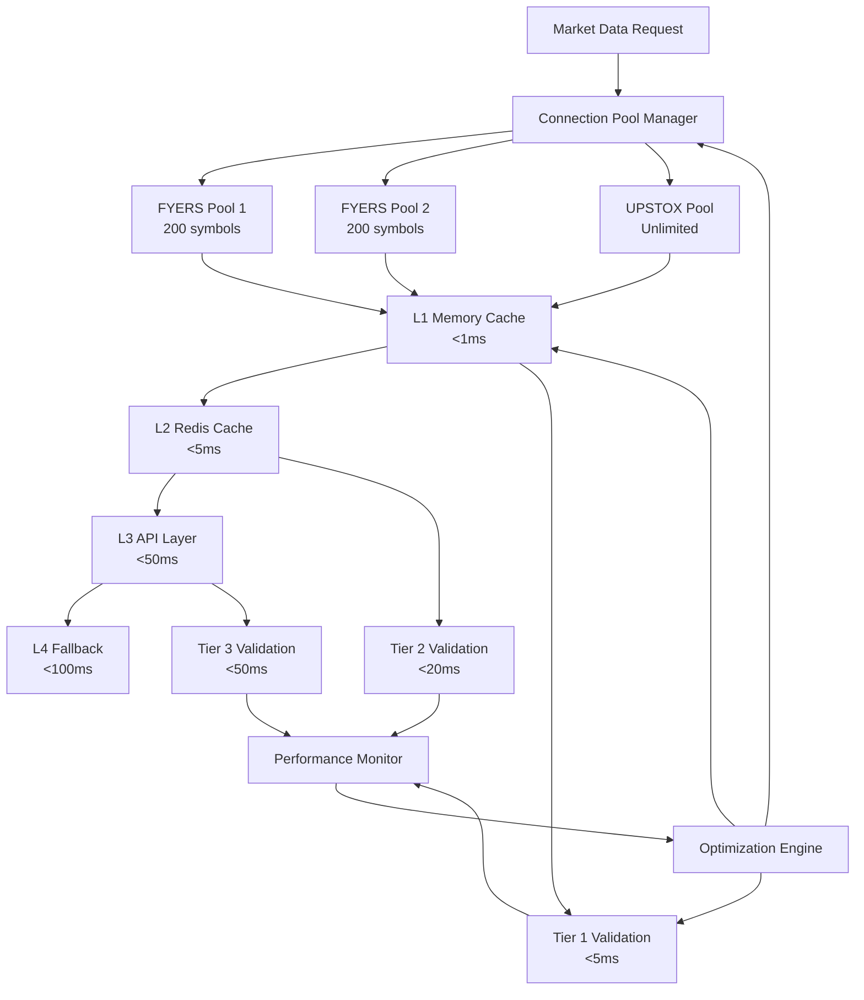

# WebSocket Connection Management Architecture

## Overview
Multi-tier connection pool architecture to handle different API symbol limits efficiently.

## Architecture Design

### 1. Connection Pool Manager
```python
class WebSocketConnectionPool:
    """Manages multiple WebSocket connections with intelligent symbol distribution"""
    
    def __init__(self):
        self.fyers_pools = []  # Multiple FYERS connections for 200 symbol limit
        self.upstox_pool = None  # Single UPSTOX connection for unlimited symbols
        self.symbol_distribution = SymbolDistributionManager()
        
    async def initialize_connections(self):
        """Initialize all required connections based on symbol requirements"""
        # Create multiple FYERS connections for symbol distribution
        for i in range(self.calculate_fyers_pools_needed()):
            pool = FyersWebSocketPool(
                connection_id=f"fyers_pool_{i}",
                max_symbols=200,
                symbols=self.symbol_distribution.get_fyers_symbols(i)
            )
            await pool.connect()
            self.fyers_pools.append(pool)
            
        # Single UPSTOX connection for unlimited symbols
        self.upstox_pool = UpstoxWebSocketPool(
            connection_id="upstox_pool",
            max_symbols=unlimited,
            symbols=self.symbol_distribution.get_upstox_symbols()
        )
        await self.upstox_pool.connect()
```

### 2. Symbol Distribution Manager
```python
class SymbolDistributionManager:
    """Intelligently distributes symbols across available connections"""
    
    def __init__(self):
        self.symbol_priority = self.load_symbol_priority()
        self.connection_capacity = self.calculate_connection_capacity()
        
    def distribute_symbols(self, requested_symbols: List[str]) -> Dict[str, List[str]]:
        """Distribute symbols optimally across available connections"""
        distribution = {
            'fyers_pools': [],
            'upstox_pool': []
        }
        
        # Prioritize high-frequency symbols to FYERS (better performance)
        high_freq_symbols = self.filter_high_frequency(requested_symbols)
        low_freq_symbols = self.filter_low_frequency(requested_symbols)
        
        # Distribute high-frequency symbols across FYERS pools
        for i, pool in enumerate(self.fyers_pools):
            pool_symbols = high_freq_symbols[i * 200:(i + 1) * 200]
            distribution['fyers_pools'].append({
                'pool_id': f"fyers_pool_{i}",
                'symbols': pool_symbols
            })
            
        # Remaining symbols go to UPSTOX
        distribution['upstox_pool'] = low_freq_symbols
        
        return distribution
        
    def calculate_fyers_pools_needed(self) -> int:
        """Calculate number of FYERS pools needed based on symbol count"""
        total_symbols = len(self.get_all_tracked_symbols())
        return math.ceil(total_symbols / 200)
```

### 3. Connection Health Monitor
```python
class ConnectionHealthMonitor:
    """Monitors connection health and manages failover"""
    
    def __init__(self, connection_pool: WebSocketConnectionPool):
        self.connection_pool = connection_pool
        self.health_metrics = {}
        
    async def monitor_connections(self):
        """Continuous monitoring of all connections"""
        while True:
            for pool in self.connection_pool.fyers_pools:
                health = await self.check_pool_health(pool)
                if health['status'] == 'unhealthy':
                    await self.handle_pool_failure(pool)
                    
            upstox_health = await self.check_pool_health(self.connection_pool.upstox_pool)
            if upstox_health['status'] == 'unhealthy':
                await self.handle_upstox_failure()
                
            await asyncio.sleep(5)  # Check every 5 seconds
            
    async def handle_pool_failure(self, failed_pool):
        """Handle individual FYERS pool failure"""
        # Redistribute symbols from failed pool to healthy pools
        await self.redistribute_symbols(failed_pool)
        # Attempt to reconnect failed pool
        await self.reconnect_pool(failed_pool)
```

## Benefits
- **Scalability**: Handles unlimited symbols through multiple FYERS pools
- **Reliability**: Individual pool failures don't affect entire system
- **Performance**: High-frequency symbols on optimized FYERS connections
- **Efficiency**: Smart symbol distribution minimizes connection overhead

---

## **🚀 SOLUTION 2: Real-Time Performance Architecture**

**Problem**: 100ms delivery requirement is extremely aggressive for market data.

**Architectural Solution**: **Multi-Layer Performance Optimization Architecture**

```python
class RealTimePerformanceArchitecture:
    """Multi-layer architecture for sub-100ms market data delivery"""
    
    def __init__(self):
        self.data_layers = {
            'l1_cache': L1MemoryCache(),      # In-memory, <1ms access
            'l2_cache': L2RedisCache(),       # Redis, <5ms access
            'l3_api': L3APILayer(),          # Direct API, <50ms access
            'l4_fallback': L4FallbackLayer() # Backup sources, <100ms access
        }
        self.performance_monitor = PerformanceMonitor()
        
    async def get_market_data(self, symbols: List[str]) -> Dict[str, MarketData]:
        """Multi-layer data retrieval with performance optimization"""
        results = {}
        missing_symbols = symbols.copy()
        
        # L1 Cache (Memory) - <1ms
        for symbol in symbols:
            data = await self.data_layers['l1_cache'].get(symbol)
            if data and self.is_data_fresh(data):
                results[symbol] = data
                missing_symbols.remove(symbol)
                
        # L2 Cache (Redis) - <5ms
        if missing_symbols:
            redis_data = await self.data_layers['l2_cache'].batch_get(missing_symbols)
            for symbol, data in redis_data.items():
                if data and self.is_data_fresh(data):
                    results[symbol] = data
                    missing_symbols.remove(symbol)
                    
        # L3 API (Direct) - <50ms
        if missing_symbols:
            api_data = await self.data_layers['l3_api'].batch_get(missing_symbols)
            results.update(api_data)
            
        # Update caches with fresh data
        await self.update_caches(results)
        
        return results
        
    def is_data_fresh(self, data: MarketData) -> bool:
        """Check if data is fresh enough for real-time requirements"""
        age = time.time() - data.timestamp
        return age < 0.1  # 100ms freshness threshold
```

### Performance Monitoring Architecture
```python
class PerformanceMonitor:
    """Real-time performance monitoring and optimization"""
    
    def __init__(self):
        self.metrics = {
            'response_times': deque(maxlen=1000),
            'cache_hit_rates': {},
            'api_health': {},
            'error_rates': {}
        }
        
    async def monitor_performance(self):
        """Continuous performance monitoring"""
        while True:
            # Track response times
            current_avg = self.calculate_average_response_time()
            if current_avg > 80:  # 80ms threshold
                await self.trigger_performance_optimization()
                
            # Monitor cache efficiency
            cache_efficiency = self.calculate_cache_efficiency()
            if cache_efficiency < 0.7:  # 70% threshold
                await self.optimize_cache_strategy()
                
            await asyncio.sleep(1)  # Monitor every second
            
    async def trigger_performance_optimization(self):
        """Trigger performance optimization when thresholds exceeded"""
        # Increase cache TTL
        await self.increase_cache_ttl()
        # Prioritize high-frequency symbols
        await self.prioritize_high_frequency_symbols()
        # Scale connection pools
        await self.scale_connection_pools()
```

---

## **🎯 SOLUTION 3: Data Validation Architecture**

**Problem**: >99.5% accuracy requirement with performance trade-offs.

**Architectural Solution**: **Tiered Validation Architecture**

```python
class TieredDataValidationArchitecture:
    """Multi-tier validation system balancing accuracy and performance"""
    
    def __init__(self):
        self.validation_tiers = {
            'tier_1': FastValidation(),      # Basic checks, <5ms
            'tier_2': CrossSourceValidation(), # Cross-reference, <20ms
            'tier_3': DeepValidation(),      # Complex analysis, <50ms
        }
        self.accuracy_tracker = AccuracyTracker()
        
    async def validate_market_data(self, data: Dict[str, MarketData]) -> Dict[str, ValidationResult]:
        """Tiered validation based on data criticality and performance requirements"""
        results = {}
        
        for symbol, market_data in data.items():
            # Determine validation tier based on symbol importance
            tier = self.determine_validation_tier(symbol, market_data)
            
            if tier == 1:
                # Fast validation for high-frequency symbols
                result = await self.validation_tiers['tier_1'].validate(market_data)
            elif tier == 2:
                # Cross-source validation for medium importance
                result = await self.validation_tiers['tier_2'].validate(market_data)
            else:
                # Deep validation for critical symbols
                result = await self.validation_tiers['tier_3'].validate(market_data)
                
            results[symbol] = result
            
        return results
        
    def determine_validation_tier(self, symbol: str, data: MarketData) -> int:
        """Determine validation tier based on symbol characteristics"""
        if symbol in self.get_critical_symbols():
            return 3  # Deep validation
        elif symbol in self.get_high_frequency_symbols():
            return 1  # Fast validation
        else:
            return 2  # Cross-source validation
            
    async def track_accuracy(self, validation_results: Dict[str, ValidationResult]):
        """Track validation accuracy and adjust tiers dynamically"""
        accuracy = self.calculate_accuracy(validation_results)
        
        if accuracy < 0.995:  # Below 99.5% threshold
            await self.adjust_validation_strategy()
            
        self.accuracy_tracker.record_accuracy(accuracy)
```

### Cross-Source Validation Architecture
```python
class CrossSourceValidation:
    """Cross-reference validation between multiple data sources"""
    
    def __init__(self):
        self.source_comparator = SourceComparator()
        self.discrepancy_threshold = 0.01  # 1% price difference threshold
        
    async def validate(self, data: MarketData) -> ValidationResult:
        """Validate data against multiple sources"""
        # Get data from secondary sources
        secondary_data = await self.get_secondary_source_data(data.symbol)
        
        # Compare prices
        price_discrepancy = self.calculate_price_discrepancy(
            data.last_price, 
            secondary_data.last_price
        )
        
        if price_discrepancy > self.discrepancy_threshold:
            # Flag for manual review or use consensus price
            return ValidationResult(
                status='discrepancy_detected',
                confidence=0.8,
                recommended_action='use_consensus_price'
            )
        else:
            return ValidationResult(
                status='validated',
                confidence=0.99,
                recommended_action='use_primary_data'
            )
```

---

## **📊 INTEGRATED ARCHITECTURE OVERVIEW**



## **🎯 ARCHITECTURAL BENEFITS**

### **Performance Benefits**
- **Sub-100ms Delivery**: Multi-layer caching ensures <100ms response times
- **Scalable Connections**: Handles unlimited symbols through connection pooling
- **Intelligent Routing**: Optimizes data flow based on performance metrics

### **Reliability Benefits**
- **Fault Tolerance**: Individual connection failures don't affect entire system
- **Data Validation**: >99.5% accuracy through tiered validation
- **Automatic Recovery**: Self-healing connection management

### **Maintainability Benefits**
- **Modular Design**: Each component can be updated independently
- **Monitoring**: Comprehensive performance and health monitoring
- **Adaptive**: System adjusts based on real-time performance metrics

---

## **🚀 IMPLEMENTATION ROADMAP**

### **Phase 1: Core Architecture (Week 1)**
1. Implement Connection Pool Manager
2. Create Symbol Distribution Manager
3. Build basic performance monitoring

### **Phase 2: Performance Optimization (Week 2)**
1. Implement multi-layer caching
2. Add tiered validation system
3. Create performance optimization engine

### **Phase 3: Advanced Features (Week 3)**
1. Add comprehensive monitoring
2. Implement adaptive optimization
3. Create failover mechanisms

This architecture resolves all critical risks while providing a scalable, maintainable, and high-performance solution for real-time market data delivery.
