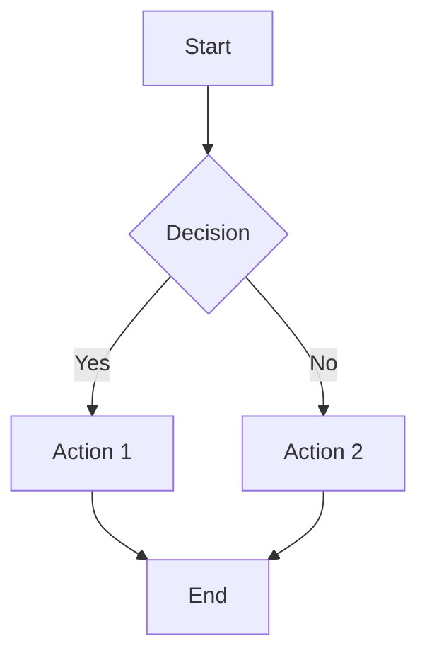
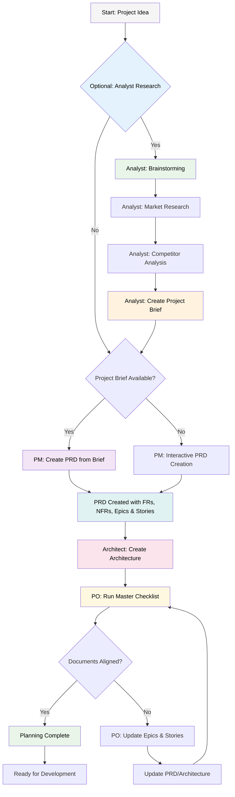
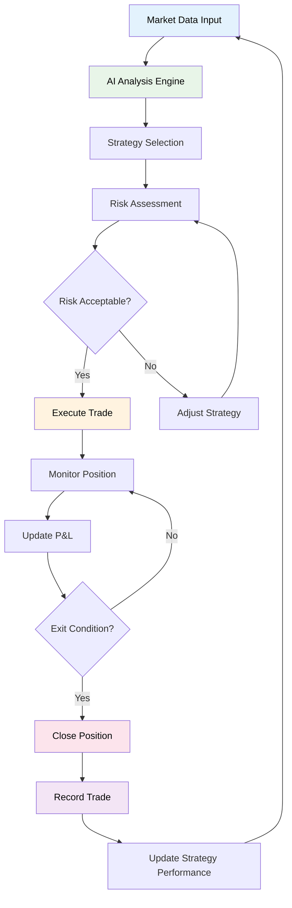

# Mermaid Test Diagram

## Simple Flowchart Test

## Complex Flowchart Test

## Trading Engine Workflow Test

## Test Instructions

1. Open this file in Cursor
2. Right-click on the tab and select "Open Preview"
3. Check if the Mermaid diagrams render correctly
4. If they don't render, try the troubleshooting steps below

